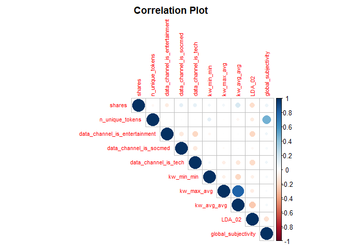

Project2
================
Zhijun Liu
2020-07-03

  - [Introduction](#introduction)
  - [Data](#data)
  - [Summarizations](#summarizations)
      - [Correlation Analysis](#correlation-analysis)
      - [Summary Statistics](#summary-statistics)
      - [Oringinal Accuracy](#oringinal-accuracy)
  - [Modeling](#modeling)
      - [Linear Model](#linear-model)
      - [Non-linear Model](#non-linear-model)
  - [Model Testing](#model-testing)
      - [Linear Model](#linear-model-1)
      - [Non-linear Model](#non-linear-model-1)
  - [Models Comparison](#models-comparison)
  - [Conclusion](#conclusion)

``` r
# prepare for the packages
library(readr)
library(tidyverse)
library(leaps)
library(caret)
library(knitr)
library(corrplot)
```

# Introduction

[This dataset summarizes a heterogeneous set of features about articles
published by Mashable in a period of two
years.](https://archive.ics.uci.edu/ml/datasets/Online+News+Popularity)
In this project, we try to use a logistic regression model (linear
model) and a bagged tree model (non-linear model) to predict the number
of shares in social networks.

# Data

The full dataset has 39644 observations and 61 variables. However, there
are only 1 response and 23 predictors we interested in. And following is
the description of variables we cared about.

  - Response:
      - shares: Number of shares
  - Predictors:
      - num\_hrefs: Number of links
      - num\_self\_hrefs: Number of links to other articles published by
        Mashable
      - num\_imgs: Number of images
      - num\_keywords: Number of keywords in the metadata
      - n\_tokens\_content: Number of words in the content
      - n\_unique\_tokens: Rate of unique words in the content
      - data\_channel\_is\_entertainment: Is data channel
        ‘Entertainment’?
      - data\_channel\_is\_bus: Is data channel ‘Business’?
      - data\_channel\_is\_socmed: Is data channel ‘Social Media’?
      - data\_channel\_is\_tech: Is data channel ‘Tech’?
      - kw\_min\_min: Worst keyword (min. shares)
      - kw\_max\_max: Best keyword (max. shares)
      - kw\_max\_avg: Avg. keyword (max. shares)
      - kw\_avg\_avg: Avg. keyword (avg. shares
      - LDA\_00: Closeness to LDA topic 0
      - LDA\_01: Closeness to LDA topic 1
      - LDA\_02: Closeness to LDA topic 2
      - LDA\_03: Closeness to LDA topic 3
      - LDA\_04: Closeness to LDA topic 4
      - title\_sentiment\_polarity: Title polarity
      - global\_subjectivity: Text subjectivity
      - self\_reference\_avg\_sharess: Avg. shares of referenced
        articles in Mashable
      - min\_positive\_polarity: Min. polarity of positive words

In addition, we divide the `shares` into two groups (\< 1400 and \>=
1400), and this variable is called `sharesInd`. And then, we split our
data sets into two data sets, one is the training data set (70% of the
data) and the other is the testing data set (30% of the data).

``` r
weekday_is <- paste0("weekday_is_", params$weekday)
# read the raw data
newsData <- read_csv("data/OnlineNewsPopularity.csv")%>%
  # for specific weekday
  filter(.data[[weekday_is]]==1)%>%
  # add new variable as an indicator of shares group
  mutate(sharesInd = ifelse(shares < 1400,0,1))%>%
  # select response and predictors we interested
  select(sharesInd,
         num_hrefs, num_self_hrefs, num_imgs, num_keywords,
         n_tokens_content, n_unique_tokens, 
         data_channel_is_entertainment, 
         data_channel_is_bus,
         data_channel_is_socmed,
         data_channel_is_tech,
         kw_min_min, kw_max_max, kw_max_avg, kw_avg_avg,
         contains("LDA"),
         title_sentiment_polarity,
         global_subjectivity,
         self_reference_avg_sharess,
         min_positive_polarity)

# change the indicator type into factor
newsData$sharesInd <- as.factor(newsData$sharesInd)

# set seed to generate reproducable results
set.seed(1) 
# split raw data set into training data set and test data set
train <- sample(1:nrow(newsData), size = nrow(newsData)*0.7) 
test <- dplyr::setdiff(1:nrow(newsData), train)
newsDataTrain <- newsData[train, ] 
newsDataTest <- newsData[test, ]

# checking the dimension of our training and testing data sets
dim(newsDataTrain)
```

    ## [1] 5086   24

``` r
dim(newsDataTest)
```

    ## [1] 2181   24

From the above 23 potential predictors, we use mallow’s cp and BIC to
choose the variables which can be used in the linear model. Therefore,
we use `newsDataFit` data set for fitting the linear model and use
`newsDataTrain` data set for fitting the non-linear model.

``` r
# variables selection process
all<-regsubsets(sharesInd ~., 
                data=newsDataTrain, 
                nbest=1, really.big=T)
```

    ## Reordering variables and trying again:

``` r
info <- summary(all)
# combine the information of some marks
selectData<-cbind(info$which, round(cbind(rsq=info$rsq, 
                              adjr2=info$adjr2,
                              cp=info$cp,
                              bic=info$bic, 
                              rss=info$rss), 3)) %>% 
  tbl_df() %>% arrange(bic)

# get the variables' name from above result
varName <- colnames(selectData)[which(selectData[1,] == 1)][-1]
varName
```

    ## [1] "n_unique_tokens"               "data_channel_is_entertainment"
    ## [3] "data_channel_is_socmed"        "data_channel_is_tech"         
    ## [5] "kw_min_min"                    "kw_max_avg"                   
    ## [7] "kw_avg_avg"                    "LDA_02"                       
    ## [9] "global_subjectivity"

``` r
# generate the data set only from above results
newsDataFit <- newsDataTrain %>%
  select(sharesInd,contains(varName))
```

# Summarizations

## Correlation Analysis

``` r
# reorganize the data to do the correlation analysis
shares <- as.numeric(newsDataFit$sharesInd)
cor.data <- cbind(shares, newsDataFit[,-1])
corrplot(cor(cor.data), 
         lower.col = "steelblue",
         type="upper",
         tl.cex = 0.7,
         title="Correlation Plot",
         mar=c(0,0,2,0))
```



``` r
# get the name of variables who have positive or negative relationship with our response
p_idx <- which(cor(newsDataFit[,-1],as.numeric(newsDataFit$sharesInd)) > 0)
n_idx <- which(cor(newsDataFit[,-1],as.numeric(newsDataFit$sharesInd)) < 0)
# Positive relationships
colnames(newsDataFit)[p_idx+1]
```

    ## [1] "data_channel_is_socmed" "data_channel_is_tech"   "kw_min_min"            
    ## [4] "kw_max_avg"             "kw_avg_avg"             "global_subjectivity"

``` r
# Negative relationships
colnames(newsDataFit)[n_idx+1]
```

    ## [1] "n_unique_tokens"               "data_channel_is_entertainment"
    ## [3] "LDA_02"

There are some variables who might have positive linear relationship
with our response: num\_imgs, num\_keywords, n\_tokens\_content,
n\_unique\_tokens, data\_channel\_is\_entertainment,
data\_channel\_is\_socmed.

And there are some variables who might have negative linear relationship
with our response: num\_hrefs, num\_self\_hrefs, data\_channel\_is\_bus.

## Summary Statistics

From the summary results of our training data set, we know that the
exact number of each shares group. Furthermore, we should standardize
our variables before fitting the model due to the extreme differences in
the maximum of each variable.

``` r
# get the summary statistics of our training data set
summary(newsDataTrain)
```

    ##  sharesInd   num_hrefs      num_self_hrefs      num_imgs        num_keywords   
    ##  0:2508    Min.   :  0.00   Min.   : 0.000   Min.   :  0.000   Min.   : 1.000  
    ##  1:2578    1st Qu.:  4.00   1st Qu.: 1.000   1st Qu.:  1.000   1st Qu.: 6.000  
    ##            Median :  7.00   Median : 2.000   Median :  1.000   Median : 7.000  
    ##            Mean   : 10.56   Mean   : 3.131   Mean   :  4.413   Mean   : 7.156  
    ##            3rd Qu.: 13.00   3rd Qu.: 4.000   3rd Qu.:  3.000   3rd Qu.: 9.000  
    ##            Max.   :140.00   Max.   :56.000   Max.   :100.000   Max.   :10.000  
    ##  n_tokens_content n_unique_tokens  data_channel_is_entertainment
    ##  Min.   :   0.0   Min.   :0.0000   Min.   :0.0000               
    ##  1st Qu.: 245.0   1st Qu.:0.4720   1st Qu.:0.0000               
    ##  Median : 398.5   Median :0.5408   Median :0.0000               
    ##  Mean   : 538.8   Mean   :0.5314   Mean   :0.1697               
    ##  3rd Qu.: 697.8   3rd Qu.:0.6093   3rd Qu.:0.0000               
    ##  Max.   :4585.0   Max.   :0.9545   Max.   :1.0000               
    ##  data_channel_is_bus data_channel_is_socmed data_channel_is_tech
    ##  Min.   :0.0000      Min.   :0.00000        Min.   :0.0000      
    ##  1st Qu.:0.0000      1st Qu.:0.00000        1st Qu.:0.0000      
    ##  Median :0.0000      Median :0.00000        Median :0.0000      
    ##  Mean   :0.1764      Mean   :0.06076        Mean   :0.1754      
    ##  3rd Qu.:0.0000      3rd Qu.:0.00000        3rd Qu.:0.0000      
    ##  Max.   :1.0000      Max.   :1.00000        Max.   :1.0000      
    ##    kw_min_min       kw_max_max       kw_max_avg       kw_avg_avg   
    ##  Min.   : -1.00   Min.   : 11100   Min.   :  2241   Min.   :  489  
    ##  1st Qu.: -1.00   1st Qu.:843300   1st Qu.:  3573   1st Qu.: 2381  
    ##  Median : -1.00   Median :843300   Median :  4333   Median : 2865  
    ##  Mean   : 27.39   Mean   :749665   Mean   :  5665   Mean   : 3126  
    ##  3rd Qu.:  4.00   3rd Qu.:843300   3rd Qu.:  6012   3rd Qu.: 3569  
    ##  Max.   :377.00   Max.   :843300   Max.   :128500   Max.   :24260  
    ##      LDA_00            LDA_01            LDA_02            LDA_03       
    ##  Min.   :0.01818   Min.   :0.01818   Min.   :0.01818   Min.   :0.01818  
    ##  1st Qu.:0.02526   1st Qu.:0.02502   1st Qu.:0.02857   1st Qu.:0.02655  
    ##  Median :0.03430   Median :0.03335   Median :0.04002   Median :0.04000  
    ##  Mean   :0.19720   Mean   :0.13972   Mean   :0.21750   Mean   :0.21549  
    ##  3rd Qu.:0.28476   3rd Qu.:0.15178   3rd Qu.:0.32720   3rd Qu.:0.35064  
    ##  Max.   :0.92000   Max.   :0.91997   Max.   :0.92000   Max.   :0.91994  
    ##      LDA_04        title_sentiment_polarity global_subjectivity
    ##  Min.   :0.01818   Min.   :-1.00000         Min.   :0.0000     
    ##  1st Qu.:0.02857   1st Qu.: 0.00000         1st Qu.:0.3957     
    ##  Median :0.05000   Median : 0.00000         Median :0.4523     
    ##  Mean   :0.23009   Mean   : 0.06867         Mean   :0.4423     
    ##  3rd Qu.:0.39236   3rd Qu.: 0.13854         3rd Qu.:0.5082     
    ##  Max.   :0.92645   Max.   : 1.00000         Max.   :0.9222     
    ##  self_reference_avg_sharess min_positive_polarity
    ##  Min.   :     0             Min.   :0.00000      
    ##  1st Qu.:   926             1st Qu.:0.05000      
    ##  Median :  2185             Median :0.10000      
    ##  Mean   :  6162             Mean   :0.09614      
    ##  3rd Qu.:  5040             3rd Qu.:0.10000      
    ##  Max.   :690400             Max.   :0.75000

## Oringinal Accuracy

According to the contingency table, we calculate the accuracy for each
data set by treating all the shares as in the “\>= 1400” group.

``` r
# accuracy for training data set if we treat all the shares as in the >= 1400 group
orgAccuracyTrain <- round(table(newsDataTrain$sharesInd)[2]/nrow(newsDataTrain),4)
orgAccuracyTrain
```

    ##      1 
    ## 0.5069

``` r
# accuracy for testing data set if we treat all the shares as in the >= 1400 group
orgAccuracyTest <- round(table(newsDataTest$sharesInd)[2]/nrow(newsDataTest),4)
orgAccuracyTest
```

    ##      1 
    ## 0.5002

# Modeling

## Linear Model

We use the variables to choose from mallow’s cp and BIC as our
predictors in the linear model. Therefore, we use `newsDataFit` data set
for the linear model. But before fitting the model we should standardize
our data first. And then, we need to calculate odds for given predictors
and convert them into binary variables. After the prediction process, we
using the confusion matrix to get the accuracy of the linear model for
the training data set.

``` r
# standardize our data set
std.newsDataFit<- cbind(newsDataFit[,1],scale(newsDataFit[,-1]))

# fit the linear model
linearModel <- glm(sharesInd ~ .,std.newsDataFit,family="binomial")
# get the result of linear model
summary(linearModel)
```

    ## 
    ## Call:
    ## glm(formula = sharesInd ~ ., family = "binomial", data = std.newsDataFit)
    ## 
    ## Deviance Residuals: 
    ##     Min       1Q   Median       3Q      Max  
    ## -2.2026  -1.0507   0.5923   1.0552   1.8460  
    ## 
    ## Coefficients:
    ##                               Estimate Std. Error z value Pr(>|z|)    
    ## (Intercept)                    0.03501    0.02967   1.180    0.238    
    ## n_unique_tokens               -0.18855    0.03432  -5.494 3.93e-08 ***
    ## data_channel_is_entertainment -0.20682    0.03181  -6.503 7.89e-11 ***
    ## data_channel_is_socmed         0.21647    0.03258   6.644 3.05e-11 ***
    ## data_channel_is_tech           0.20490    0.03222   6.359 2.03e-10 ***
    ## kw_min_min                     0.22075    0.03158   6.990 2.75e-12 ***
    ## kw_max_avg                    -0.41168    0.05531  -7.443 9.86e-14 ***
    ## kw_avg_avg                     0.69397    0.05923  11.717  < 2e-16 ***
    ## LDA_02                        -0.20109    0.03481  -5.778 7.58e-09 ***
    ## global_subjectivity            0.18059    0.03453   5.229 1.70e-07 ***
    ## ---
    ## Signif. codes:  0 '***' 0.001 '**' 0.01 '*' 0.05 '.' 0.1 ' ' 1
    ## 
    ## (Dispersion parameter for binomial family taken to be 1)
    ## 
    ##     Null deviance: 7049.7  on 5085  degrees of freedom
    ## Residual deviance: 6502.9  on 5076  degrees of freedom
    ## AIC: 6522.9
    ## 
    ## Number of Fisher Scoring iterations: 4

``` r
# predict reponse of training data set by fitting model 
# get the log-odds and convert it into binomial variable
linearTrainPred <- ifelse(exp(predict(linearModel,
                                      newdata = std.newsDataFit,
                                      type="link"))<1,0,1)
# Corss validation for training data set
linearFit <- confusionMatrix(as.factor(linearTrainPred), newsDataFit$sharesInd)
linearFit
```

    ## Confusion Matrix and Statistics
    ## 
    ##           Reference
    ## Prediction    0    1
    ##          0 1601  889
    ##          1  907 1689
    ##                                         
    ##                Accuracy : 0.6469        
    ##                  95% CI : (0.6336, 0.66)
    ##     No Information Rate : 0.5069        
    ##     P-Value [Acc > NIR] : <2e-16        
    ##                                         
    ##                   Kappa : 0.2935        
    ##                                         
    ##  Mcnemar's Test P-Value : 0.6883        
    ##                                         
    ##             Sensitivity : 0.6384        
    ##             Specificity : 0.6552        
    ##          Pos Pred Value : 0.6430        
    ##          Neg Pred Value : 0.6506        
    ##              Prevalence : 0.4931        
    ##          Detection Rate : 0.3148        
    ##    Detection Prevalence : 0.4896        
    ##       Balanced Accuracy : 0.6468        
    ##                                         
    ##        'Positive' Class : 0             
    ## 

## Non-linear Model

We use `newsDataTrain` data set for fitting the bagged tree model. The
bagged tree model is a method combining the bootstrap and the tree
model. It creates a bootstrap sample first and then uses a train tree on
this sample. Also, we standardize the variables before fitting the
model.

``` r
# set seed to get a reproducable result
set.seed(1)
# fit the bagged tree model
treebagFit <- train(sharesInd ~ ., 
                    data = newsDataTrain, 
                    method = "treebag", 
                    tuneLength = 10,
                    # standardize the variables
                    preProcess = c("center", "scale"))
# get the fit result of training data set
treebagFit
```

    ## Bagged CART 
    ## 
    ## 5086 samples
    ##   23 predictor
    ##    2 classes: '0', '1' 
    ## 
    ## Pre-processing: centered (23), scaled (23) 
    ## Resampling: Bootstrapped (25 reps) 
    ## Summary of sample sizes: 5086, 5086, 5086, 5086, 5086, 5086, ... 
    ## Resampling results:
    ## 
    ##   Accuracy   Kappa    
    ##   0.6229077  0.2456126

# Model Testing

## Linear Model

Before the predictions, we should standardize our test data first. And
then, we need to calculate odds for given predictors and convert them
into binary variables. After the prediction process, we use the
confusion matrix to get the accuracy of the linear model for the testing
data set.

``` r
# standardize our data set
std.newsDataTest<- cbind(newsDataTest[,1], scale(newsDataTest[,-1]))

# predict reponse of testing data set by fitting model
linearTestPred <- ifelse(exp(predict(linearModel,
                                     newdata = std.newsDataTest,
                                     type="link"))<1,0,1)
# Corss validation of testing data set
linearResult <- confusionMatrix(as.factor(linearTestPred), newsDataTest$sharesInd)
linearResult
```

    ## Confusion Matrix and Statistics
    ## 
    ##           Reference
    ## Prediction   0   1
    ##          0 684 378
    ##          1 406 713
    ##                                         
    ##                Accuracy : 0.6405        
    ##                  95% CI : (0.62, 0.6607)
    ##     No Information Rate : 0.5002        
    ##     P-Value [Acc > NIR] : <2e-16        
    ##                                         
    ##                   Kappa : 0.2811        
    ##                                         
    ##  Mcnemar's Test P-Value : 0.3349        
    ##                                         
    ##             Sensitivity : 0.6275        
    ##             Specificity : 0.6535        
    ##          Pos Pred Value : 0.6441        
    ##          Neg Pred Value : 0.6372        
    ##              Prevalence : 0.4998        
    ##          Detection Rate : 0.3136        
    ##    Detection Prevalence : 0.4869        
    ##       Balanced Accuracy : 0.6405        
    ##                                         
    ##        'Positive' Class : 0             
    ## 

## Non-linear Model

We use the bagged tree model to predict the `sharesInd` in the testing
data set. And then, we calculate the accuracy of testing data set by the
confusion matrix.

``` r
# predict reponse of testing data set by fitting model
treebagTestPred <- predict(treebagFit, newdata = newsDataTest)
# Corss validation of testing data set
treebagResult <- confusionMatrix(treebagTestPred, newsDataTest$sharesInd)
treebagResult
```

    ## Confusion Matrix and Statistics
    ## 
    ##           Reference
    ## Prediction   0   1
    ##          0 678 389
    ##          1 412 702
    ##                                          
    ##                Accuracy : 0.6327         
    ##                  95% CI : (0.6121, 0.653)
    ##     No Information Rate : 0.5002         
    ##     P-Value [Acc > NIR] : <2e-16         
    ##                                          
    ##                   Kappa : 0.2655         
    ##                                          
    ##  Mcnemar's Test P-Value : 0.437          
    ##                                          
    ##             Sensitivity : 0.6220         
    ##             Specificity : 0.6434         
    ##          Pos Pred Value : 0.6354         
    ##          Neg Pred Value : 0.6302         
    ##              Prevalence : 0.4998         
    ##          Detection Rate : 0.3109         
    ##    Detection Prevalence : 0.4892         
    ##       Balanced Accuracy : 0.6327         
    ##                                          
    ##        'Positive' Class : 0              
    ## 

# Models Comparison

``` r
# combine the accuracy of corss validation together
Accuracytable <- round(data.frame(Train=rbind(linearFit$overall[1],
                                             treebagFit$results$Accuracy,
                                             orgAccuracyTrain),
                                 Test = rbind(linearResult$overall[1],
                                              treebagResult$overall[1],
                                              orgAccuracyTest),
                                 row.names = c("Logistic Regression",
                                               "Bagged Tree",
                                               "Original Data")
                                 ),4)
# caculate the misclassification rate (Apparent Error)
APERtable <- 1-Accuracytable

# print the table
kable(Accuracytable,
      row.names=TRUE,
      col.names = c("Train","Test"),
      caption = "Accuracy Table")
```

|                     |  Train |   Test |
| ------------------- | -----: | -----: |
| Logistic Regression | 0.6469 | 0.6405 |
| Bagged Tree         | 0.6229 | 0.6327 |
| Original Data       | 0.5069 | 0.5002 |

Accuracy Table

``` r
kable(APERtable ,
      row.names=TRUE,
      col.names = c("Train","Test"),
      caption = "APER Table")
```

|                     |  Train |   Test |
| ------------------- | -----: | -----: |
| Logistic Regression | 0.3531 | 0.3595 |
| Bagged Tree         | 0.3771 | 0.3673 |
| Original Data       | 0.4931 | 0.4998 |

APER Table

``` r
# the best model for training data set
bestTrainModel <- APERtable %>% arrange(Accuracy)
rownames(bestTrainModel[1,])
```

    ## [1] "Logistic Regression"

``` r
# the best model for testing data set
bestTestModel <- APERtable %>% arrange(Accuracy.1)
rownames(bestTestModel[1,])
```

    ## [1] "Logistic Regression"

According to the results of the APER table, we would choose the smallest
value as the best model for each data set. In this case, our best model
for the training data set is Logistic Regression and the best model for
testing data set is Logistic Regression. However, if the best model
turns out to be the Original Data, neither the linear model nor the
non-linear model had done the job well.

# Conclusion

For THURSDAY data, I would choose the Logistic Regression because it fit
testing data sets better. And if I use this model, I would expect 35.95%
as its misclassification rate.
